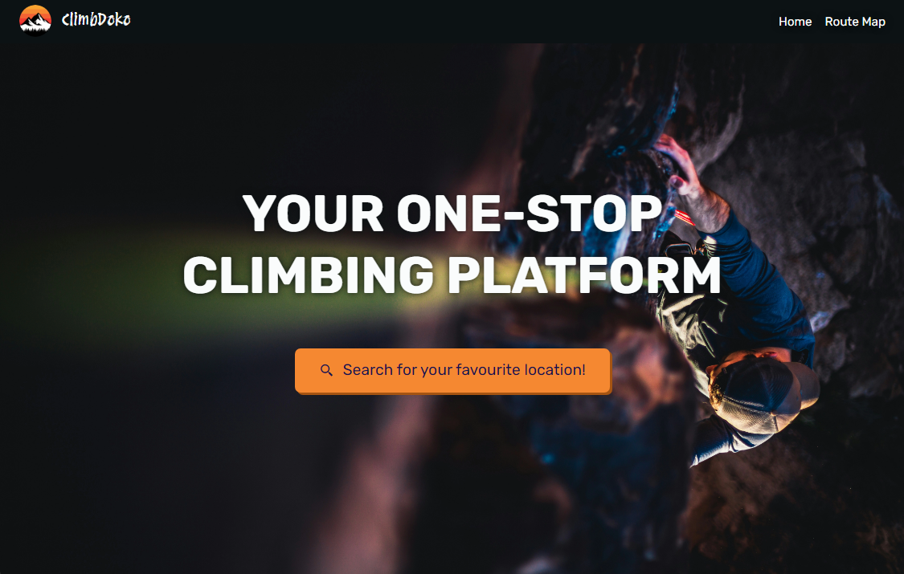

# ClimbDoko
Climbdoko - your ONE-STOP climbing platform. Designed by climbers, for climbers, you can quickly look up for your favourite climbing locations with just a click of a button. Looking for directions on how to get to that one climbing gym? Craving some late night snacks after a long and fufilling day of climbing? Or better - trying to beat the weather for your next ascent? ClimbDoko is the perfect solution to all your needs!

## Table of Contents
1. [Overview](#overview)
2. [Usage and Screenshots](#usage-and-screenshots)
3. [Technologies Used](#technologies-used)
4. [References](#references)

## Overview
ClimbDoko aims to be an alternative to major climbing websites such as TheCrag and MountainProject, providing users with a simplified way to search for information on their favourite climbing spots. 

### Home Page
The home page contains a catch phrase that entices users who visits the webpage. It aims to redirect the users to the route map page with one click.

### Route Map Page
Within the route map page, users can access the sidebars and markers on the interactive map to find their favourite climbing places. They can look up the
* *Nearby Climbing Locations* Skim through the nearest climbing gyms and routes in the default sidebar
* *Directions to Climbing Locations* Get route information from their current location
* *Nearby Amenities* Search for amenities near each climbing location, such as toilets, restaurant and accomodation
* *Weather Forecast* Get updated weather information for the current and next 4 days.

## Usage and Screenshots
1. Open the main index.html file, and switch to the route map page.
2. Use the search bar on top, or the sidebar, to search for your favourite climbing spots
3. Click on each markers to access the key features, such as the directions, nearby amenities and weather to/at each climbing location

## Technologies Used
* HTML/CSS
* JavaScript
* LeafletJS
* FourSquare API - Search & Data (Place Search and Get Place Photos)
* OpenWeather API - Current Weather Data and 5 Day / 3 Hour Forecast
* OneMap API - Authentication, Search, Reverse Geocode and Routing (Walk/Drive/Cycle)

## References
This project was made possible with these resources.
* Icons ([Boxicon](https://boxicons.com/))
* Images Resources
  * Logo ([Sunset Mountain Logo Design, Baun Studios](https://dribbble.com/shots/14917636-Sunset-Mountain-Logo-Design))
  * Hero ([selective focus photography of person hiking during daytime, Patrick Hendry](https://unsplash.com/photos/selective-focus-photography-of-person-hiking-during-daytime-WrCvD2Cgb4c))
  * Directions ([BrandEPS](https://brandeps.com/)
  * Loading Screen ([Climbing, Dribble](https://www.pinterest.com/pin/546765211013767837/))
  * Footer [Monochrome hand drawn mountain outline illustration, freepik](https://www.freepik.com/free-vector/monochrome-hand-drawn-mountain-outline-illustration_41155995.htm))
* Map
  * Interactive map ([Leaflet](https://leafletjs.com/))
  * Tile layers ([JawgMaps](https://www.jawg.io/en/), [Esri](https://leaflet-extras.github.io/leaflet-providers/preview/#filter=Esri.WorldImagery))
  * Polyline Encoder ([Leaflet.encoded, jieter](https://github.com/jieter/Leaflet.encoded/tree/master))
* JSON Files
  * Climbing gym data ([Climbodachi](https://climbodachi.com/climbing-gyms-directory/singapore/))
  * Climbing route data ([TheCrag](https://www.thecrag.com/en/home), [Mountain Project](https://www.mountainproject.com/), [OpenBeta](https://docs.openbeta.io/))
  * Country, state and city data ([countries-states-cities-database, dr5hn](https://github.com/dr5hn/countries-states-cities-database))
* APIs
  * Nearby amenities search ([FourSquare](https://foursquare.com/developers/home))
  * Current and 5-day forcasted weather ([OpenWeather](https://openweathermap.org/api))
  * Directions to climbing locations ([OneMap](https://www.onemap.gov.sg/apidocs/apidocs))
* Haversine Distance ([1](https://www.movable-type.co.uk/scripts/latlong.html), [2](https://stackoverflow.com/questions/26836146/how-to-sort-array-items-by-longitude-latitude-distance-in-javascripts))

## Other References 
* Carousel Reference: https://getbootstrap.com/docs/5.3/components/carousel/
* Slider: https://www.codingnepalweb.com/responsive-card-slider-javascript/
* 27Crags: https://27crags.com/
* NLB Website: https://www.nlb.gov.sg/main/home
* CodeAcademy: https://www.codecademy.com/resources/docs/java/classes